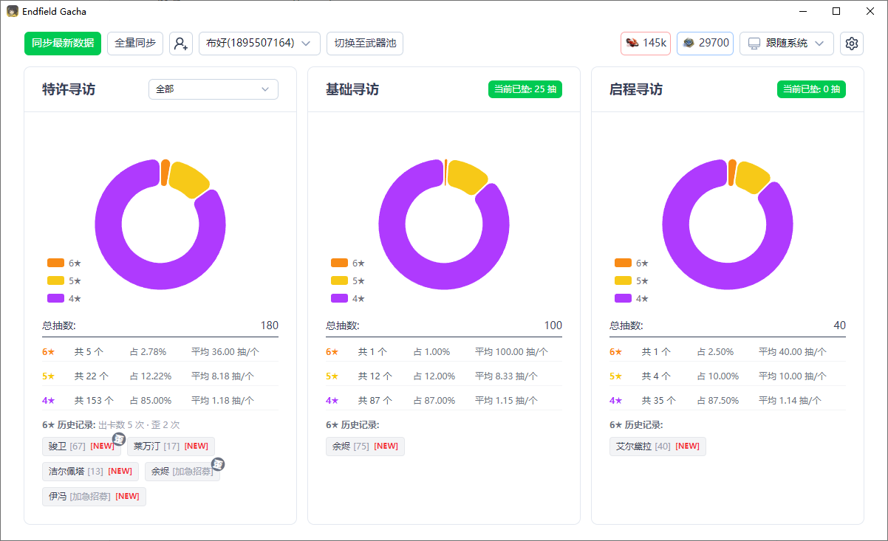

  

  <h1>Endfield Gacha</h1>

  

    <strong>“你好，咕咕嘎嘎！”</strong> 
    一个《明日方舟：终末地》寻访记录统计与分析工具 
    支持 Windows / macOS / Linux
  

  

    
    
    
    
  

---

## 功能特性

### 账号与服务器

- **多账号管理**：支持多个账号，并可在顶部快速切换查看。
- **国服 / 国际服支持**：支持国服（官服 / B服）与国际服（亚服 / 欧美服）。
- **账号信息本地保存**：账号身份凭证（Token）、统计数据与同步状态均保存在本地，不依赖第三方云服务。

### 寻访记录同步

> 日志同步方式目前暂时移除，之前使用日志同步的可以通过**添加账号**方式添加账号后可继续使用，本地用户数据依旧在，不会清空~

- **添加账号同步**：支持应用内网页登录自动获取 Token，也支持手动粘贴 Token 添加账号。
- **增量同步**：基于 `seqId` 自动判断需要补拉的分页，仅获取新的寻访记录。
- **全量同步**：支持全量拉取寻访记录，用于补齐旧寻访记录。
- **重复记录自动去重**：相同 `seqId` 的记录不会重复写入，本地会按卡池追加缺失内容。
- **同步进度可视化**：同步过程中会显示当前卡池与分页进度，便于查看同步状态。

### WebDAV 跨设备同步

- **WebDAV 远端同步**：支持将全部账号的寻访记录同步到自建 WebDAV 服务，用于多设备同步数据。
- **同步全部账号**：可在设置页直接同步全部可同步账号，自动判断上传、拉取、合并或无变化。
- **自动同步**：新增账号信息或同步到新的抽卡记录后，可自动将有变化的账号推送到 WebDAV。
- **静默模式**：开启后，自动同步时成功不提示，失败仍会提示；关闭后，无论成功或失败均提示。
- **从 WebDAV 恢复**：支持读取远端已有账号列表，并按账号选择恢复到本地。（从远端覆盖更新）
- **冲突保护**：遇到账号基础信息不一致、远端文件结构损坏或同一 `seqId` 的非名称字段冲突时，会暂停同步并保留冲突快照，避免误覆盖。
- **账号凭证不上传**：WebDAV 仅同步寻访记录与账号基础信息数据，不包含登录凭证（即 token）。

### 统计与展示

- **角色池统计**：
  - 支持多个特许寻访卡池的独立查看和聚合查看
  - 显示当前垫抽（小保底）、大保底进度、6★ 历史记录
  - 历史记录支持 `NEW` 与“歪”标记
- **武器池统计**：
  - 支持所有武器池、限定武器池、非限定武器池分类查看
  - 显示当前垫抽与当期 UP 获取情况
  - 支持多个武器池切换独立查看和聚合查看
- **稀有度分布图表**：通过图表展示不同稀有度的数量与占比。
- **历史出货统计**：支持查看平均出货抽数、各稀有度数量与 6★ 历史记录。

### 数据与导出

- **本地数据存储**：配置、卡池信息、寻访记录等均保存在本地 `userData/` 目录。
- **冲突快照落盘**：WebDAV 冲突时会自动保存本地 / 远端快照，便于解决冲突。
- **Excel 导出**：支持将当前账号的角色池与武器池记录导出为 Excel 文件。

### 同步方式

- **添加账号同步**：应用内打开网页登录并自动抓取 Token，或手动粘贴 Token。
- **WebDAV 跨设备同步**：支持将全部账号的寻访记录同步到自建 WebDAV 服务，也支持从远端恢复到本地。

### 使用体验

- **跨平台支持**：支持 Windows / macOS / Linux。
- **主题切换**：支持跟随系统、亮色模式、暗色模式。

## 技术栈

- **前端**：Nuxt 4 + Vue 3 + TypeScript
- **UI**：@nuxt/ui
- **图表**：ECharts
- **桌面端**：Tauri 2

## 界面预览

> 预览图可能与当前版本略有差异，以实际界面为准。

  

## 下载与安装

本工具支持 **Windows / macOS / Linux**

1. 前往 [Releases](https://github.com/bhaoo/endfield-gacha/releases) 页面。
2. 下载最新版本中与你系统对应的安装包（Windows / macOS / Linux）。
   - Windows 可以直接下载**便携版**（Endfield.Gacha_Portable.exe）
   - Linux 推荐通过 `deb` 方式安装（通过 `AppImage` 安装可能因为 GLib 版本问题导致打开白屏）
4. 运行即可（Windows 请确保应用所在目录具备写入权限，以便创建/写入 `userData/`）。

## 数据存储位置

- **Windows**:  `exe` 同级目录下的 `userData/` 目录中。
- **macOS**: `~/Library/Application Support/com.bhao.endfieldgacha/userData/`
- **Linux**: `~/.local/share/com.bhao.endfieldgacha/userData/`

## 使用说明

### 添加账号同步

左上角“添加账号”支持两种方式：

- **应用内打开网页登录并自动抓取 Token**（推荐）
- **手动粘贴 Token**

添加成功后，可在账号下拉选择对应角色进行同步与查看。

> [!CAUTION]
> Bilibili 渠道服 ⚠ 注意
>
> 使用 `添加账号同步` 前，请先前往鹰角网络用户中心 [角色绑定](https://user.hypergryph.com/bindCharacters?game=endfield) 处绑定 Bilibili 服帐号哦~

### 同步寻访数据

1. 先在顶部选择需要查看的角色账号。
2. 点击 **同步最新数据**，执行增量同步。
3. 如果怀疑历史数据缺失，点击 **全量同步** 重新拉取当前卡池全部记录。
4. 同步完成后，可在角色池 / 武器池页面切换查看统计结果。

## WebDAV 相关

> [!NOTE]
>
> WebDav 同步功能默认不开启，按需使用~

WebDAV 适用于多设备之间同步寻访记录。**同步内容不包含账号 Token**，Token 仍只保存在本地。

1. 打开设置页，找到 **WebDAV 同步**。
2. 填写以下信息：
   - `URL`：你的 WebDAV 服务地址，例如 `https://example.com`
   - `目录`：远端保存目录，例如 `/endfield-gacha`
   - `用户名`
   - `密码`
3. 点击 **保存配置**。
4. 点击 **连接测试**，确认基础目录和 `manifest.json` 可正常读写。
5. 点击 **立即同步全部账号**，将当前全部可同步账号推送到远端或从远端对齐。

以 OpenList 为例：

| 字段 | 值 |
|-------|-------|
| URL   | http[s]://你的域名:端口/dav/        |
| 目录   | /endfield-gacha                    |
| 用户名 | 你在 OpenList 网页端登录使用的用户名 |
| 密码   | 你在 OpenList 网页端登录使用的密码   |

### WebDAV 自动同步

设置页中可选开启 **自动同步**：

- 开启后，在以下场景会自动同步有变化的账号到 WebDAV：
  - 新增账号信息后
  - 同步到新的抽卡记录后
- **静默模式** 仅影响自动同步：
  - 开启：成功不弹提示，失败仍提示
  - 关闭：显示自动同步结果

### 从 WebDAV 恢复

> [!CAUTION]
> 从 WebDAV 恢复更接近将远端数据还原到本地；如果你希望先比较再决定而非从远端覆盖，请使用“立即同步全部账号”。

如果你在另一台设备上已经同步过数据，可以在设置页点击 **从 WebDAV 恢复**：

1. 读取远端已有账号列表。
2. 选择一个或多个账号恢复到本地。
3. 恢复后会写入本地寻访记录，并保留本地已有的登录凭证信息。

## 注意事项

- 为了防止频繁请求触发 API 风控，同步过程中连续的请求之间会设置一定的延迟，因此若所需拉取页数较多，拉取时间会稍长一些，请耐心等待 ❤。

## 免责声明

本项目为非官方工具，与 **鹰角网络 (Hypergryph)** 及其旗下组织/团体/工作室没有任何关联。游戏图片与数据版权归各自权利人所有。

- 本软件按“现状”提供，不保证可用性、稳定性或数据准确性；使用过程中造成的任何数据损失、功能异常或经济损失均由用户自行承担。
- 本软件仅供个人学习与研究使用，禁止商业化使用、再分发或提供任何增值服务；因违反上述限制产生的责任由使用者自行承担。
- 使用本软件需遵守所在地法律法规、游戏/平台服务条款及知识产权要求；如有合规/安全疑虑，请立即停止使用并卸载。
- 本项目不会采集或上传任何个人隐私，所有用户数据与登录凭据仅存储在本地；涉及的游戏数据均由用户自行选择导入/导出。

## 最后

如有建议或者问题，可以在 Issue 提出，也可以前往 [QQ 群](https://qm.qq.com/q/2TGyCGZoXS) 交流哦~

感谢 [@RoLingG](https://github.com/RoLingG)、[@YueerMoe](https://github.com/YueerMoe) 帮助完善后端相关数据。

Copyright &copy; 2026 [Bhao](https://dwd.moe/), under MIT License.
